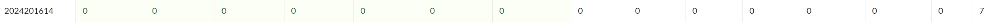

# bomblab 报告

姓名：王文涛

学号：2024201614

| 总分 | phase_1 | phase_2 | phase_3 | phase_4 | phase_5 | phase_6 | secret_phase |
| --------- | ------------- | ------------- | ------------- | ----------------- |-----------|-----------|-----------|
| 7        | 1            | 1            | 1            | 1 |1  |1  |1  |


scoreboard 截图：



<!-- TODO: 用一个scoreboard的截图，本地图片，放到 imgs 文件夹下，不要用这个 github，pandoc 解析可能有问题 -->

## 解题报告

<!-- 对你拆掉的每个phase进行分析，并写出你得出答案的历程 -->

<!-- 如果能用伪代码还原题目源代码最佳（不属于先前提到的大段代码），语言描述自己的分析也可，每道题目的图片不建议超过两张 -->

### phase_1  字符串比较

```c
If abstraction is the definition of beauty, are those of us chasing after clarity a representation of ugly?
```

讲解题目思路

将某个目标字符串传入到%rsi中，进行<strings_not_equal>比较。这时`x/s $rsi`就能看到目标字符串。

### phase_2  矩阵乘法

```c
1084708 808156 1208988 939992
```

讲解题目思路

进行了一个2\*3矩阵和3\*2矩阵的乘法，得到2*2矩阵。C代码类似于：
```c
int A[2][3] = {
    {389, 716, 200},
    {169, 944, 428}
};
int B[3][2] = {
    {1000, 548},
    {763,  724},
    {747,  383}
};
int C[2][2] = {0};
for (int i = 0; i < 2; i++) {
    for (int j = 0; j < 2; j++) {
        int sum = 0;
        for (int k = 0; k < 3; k++) {
            sum += A[i][k] * B[k][j];
        }
        C[i][j] = sum;
    }
}
```
然后比较输入的4个数字与得到的矩阵C是否一一对应。其中，%r11、%r8、%rax分别是从外到内循环的计数器，%rdi存储matA，%rsi存储matB。

每次在最内层循环时，可以通过`x/wd $rdi+$rax*4`和`x/wd $rsi+$rax*8`获取当前正在计算的两个矩阵元素。

### phase_3  switch跳转

```c
5 -836
```

讲解题目思路

需要输入两个数字，首先接受一个1~7的整数，根据这个整数跳转代码。经逐个输入，最终只有第二个数为负，且第一个数为5的时候才能进入比较，获取到比较数字为-836。

### phase_4  递归函数

```c
31 BA
```

讲解题目思路

第一个数字的处理是简单的递归函数。第二个架构类似汉诺塔程序，每次调用自身时，会通过一系列寄存器之间数据的倒换，调整%edx、%ecx、%r8的顺序。大致代码如下：
```c
void func4_2(
    int n,    // $rdi=5
    int k,    // $rsi=20
    char c1,  // $rdx='A'
    char c2,  // $rdx='C'
    char c3,  // $rdx='B'
    char *out // $r9=buffer
)
{
    if (n == 1)
    {
        out[0] = c1;
        out[1] = c2;
        out[2] = '\0';
        return;
    }

    int left_steps = func4_1(n - 1);  // 2^(n-1)-1

    // left
    if (k <= left_steps)
    {
        func4_2(
            n - 1,
            k,
            c1,
            c3,
            c2,
            out
        );
        return;
    }

    // hit
    if (k == left_steps + 1)
    {
        out[0] = c1;
        out[1] = c2;
        out[2] = '\0';
        return;
    }

    // right
    func4_2(
        n - 1,
        k - left_steps - 1,
        c3,
        c2,
        c1,
        out
    );
}
```

最好构建C代码求解。

### phase_5  字符转换

```c
jpbafh
```

讲解题目思路

获取到字符表`"maduiersnfotvbyl"`，而我们输入的字符串会转换为ASCII码后映射到表上，根据映射值组成新的字符串。目标字符串是`"flames"`，取`i=9,15,1,0,5,7`，对应其中一种输入就是`jpbafh`。

### phase_6  链表重排

```c
5 4 2 3 1 6 arcaea
```

讲解题目思路

存储在寄存器上的是一个链表结构，每次都会循环访问%rbx+8，这是链表结构体中指向下一个链表的地址。每次x/2dw其给出的地址，获取到链表信息：
```
0x55555555a210 517 node1
0x55555555a220 340 node2
0x55555555a230 389 node3
0x55555555a240 284 node4
0x55555555a250 103 node5
0x55555555a160 831 node6
```
随后根据我们输入的6个数的顺序重排这些结点，并检查是否是按递增顺序排布的。

### secret_phase  迷宫搜索

```c
cchbb
```

讲解题目思路

首先注意到phase_6读取顺序并不是使用`<sscanf>`而是`<read_six_numbers>`，查看这段代码发现只读取了前6个数字而没有管后面是否有多余的字符串。查看`<phase_defused>`段，发现其会在计数满6次通关时检查input的存储段，访问了其检查的存储地点发现是phase_6的输入。这说明phase_6需要更多的输入来激活secret_phase。调试时获取到比较的字符串，并添加到phase_6的答案后面。

func_7是一个迷宫搜索类型的问题，大致代码如下：
```c
int row_check(int a, int b)
{
    if (a < 0 || a > 7 || b < 0 || b > 7)
        return 1;

    static unsigned char row[8][8] =
        {
            {0, 0, 1, 0, 0, 1, 0, 0},
            {0, 0, 0, 1, 0, 0, 0, 1},
            {1, 0, 1, 0, 0, 1, 0, 0},
            {1, 0, 0, 0, 0, 0, 0, 0},
            {0, 1, 0, 0, 1, 0, 1, 0},
            {1, 0, 0, 0, 1, 1, 0, 0},
            {0, 0, 0, 0, 0, 1, 0, 1},
            {0, 1, 0, 0, 0, 0, 0, 0}};
    return row[a][b];
}

int func7(char *s, int a, int b, int idx)
{
    static int T0[8] = {-2, -1, 1, 2, 2, 1, -1, -2};
    static int T1[8] = {1, 2, 2, 1, -1, -2, -2, -1};
    static int T2[8] = {-1, 0, 0, 1, 1, 0, 0, -1};
    static int T3[8] = {0, 1, 1, 0, 0, -1, -1, 0};

    if (a == 4 && b == 7)
    {
        if (idx > 19)
            return 0;
        if (s[idx] == '\0')
            return 1;
    }

    if (idx > 19)
        return 0;

    unsigned char c = s[idx];
    if (!c)
        return 0;

    int k = c & 7;

    int a1 = a + T0[k];
    int b1 = b + T1[k];

    if ((a1 | b1) > 7) // 0 <= a, b <= 7
        return 0;

    int a2 = a + T2[k];
    int b2 = b + T3[k];

    if (row_check(a2, b2))
        return 0;
    if (row_check(a1, b1))
        return 0;

    return func7(s, a1, b1, idx + 1);
}
```

其中T0~T4、row链表通过x/dw出其信息：
```
0x7fffffffd9b0: -2      -1      1       2       2       1       -1      -2
0x7fffffffd9d0: 1       2       2       1       -1      -2      -2      -1
0x7fffffffd9f0: -1      0       0       1       1       0       0       -1
0x7fffffffda10: 0       1       1       0       0       -1      -1      0

0x55555555a1a0 <row0>:  0x0000010000010000      0x000055555555a1b0
0x55555555a1b0 <row1>:  0x0100000001000000      0x000055555555a1c0
0x55555555a1c0 <row2>:  0x0000010000010001      0x000055555555a1d0
0x55555555a1d0 <row3>:  0x0000000000000001      0x000055555555a1e0
0x55555555a1e0 <row4>:  0x0001000100000100      0x000055555555a1f0
0x55555555a1f0 <row5>:  0x0000000101000001      0x000055555555a200
0x55555555a200 <row6>:  0x0100010000000000      0x000055555555a150
0x55555555a150 <row7>:  0x0000000000000100      0x0000000000000000
```

只能通过另构建代码运行来进行搜索答案：
```c
char charset[] = "abcdefgh";
int found = 0;
void dfs(char *buf, int depth, int max_depth)
{
    if (found == 5)
        return;
    if (depth == max_depth)
    {
        buf[depth] = '\0';
        if (func7(buf, 0, 0, 0))
        {
            printf("FOUND: %s\n", buf);
            found += 1;
        }
        return;
    }
    for (int i = 0; i < 8 && !found; i++)
    {
        if (i == 0)
            if (charset[i] != 'c' || charset[i] != 'd')
                continue;
        buf[depth] = charset[i];
        dfs(buf, depth + 1, max_depth);
    }
}

int main()
{
    char buf[32];
    for (int len = 1; len <= 20; len++)
    {
        printf("Searching length %d...\n", len);
        dfs(buf, 0, len);
        if (found == 5)
            break;
    }
    return 0;
}
```

## 反馈/收获/感悟/总结

<!-- 这一节，你可以简单描述你在这个 lab 上花费的时间/你认为的难度/你认为不合理的地方/你认为有趣的地方 -->

<!-- 或者是收获/感悟/总结 -->

<!-- 200 字以内，可以不写 -->

对gdb方法的理解和使用的要求不亚于对汇编语言理解的要求。学会一些方便的调试方法能够更好地获取到信息。（但是除了上机视频有补充，这些没有作为教学的重点内容，需要现学）

使用在线汇编转换器，将认为合理的C代码转换成汇编，和源代码进行比较，也是一个检查逻辑的思路。

## 参考的重要资料

<!-- 有哪些文章/论文/PPT/课本对你的实现有重要启发或者帮助，或者是你直接引用了某个方法 -->

<!-- 请附上文章标题和可访问的网页路径 -->
